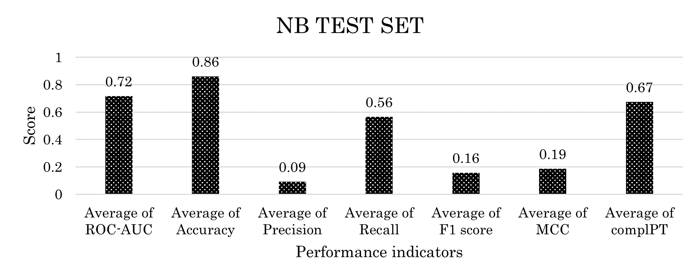

# Bankruptcy Risk Prediction Models

Η παρούσα εργασία εξετάζει τη δυνατότητα πρόβλεψης της χρεοκοπίας επιχειρήσεων μέσω μεθόδων μηχανικής μάθησης. Χρησιμοποιούνται οικονομικά δεδομένα από την περίοδο 2006-2009 και συγκρίνονται διαφορετικά μοντέλα ταξινόμησης. Η ανάλυση εστιάζει στην ακρίβεια πρόβλεψης και στη σημασία των χαρακτηριστικών που συμβάλλουν στην εκτίμηση του κινδύνου χρεοκοπίας.

This paper examines the possibility of predicting corporate bankruptcy through machine learning methods. Financial data from the period 2006-2009 are used and different classification models are compared. The analysis focuses on the prediction accuracy and the importance of the characteristics that contribute to the assessment of bankruptcy risk.

[Classification_bankr_pred.pdf](Classification_bankr_pred.pdf)

## Δεδομένα & Μεθοδολογία
- **Δεδομένα**: Περιλαμβάνουν οικονομικούς δείκτες εταιρειών.
- **Χρονική περίοδος**: 2006 - 2009.
- **Διαχωρισμός δεδομένων**: 4-fold cross-validation.
- **Μέθοδοι προεπεξεργασίας**: Καθαρισμός δεδομένων, κανονικοποίηση.
- **Μοντέλα**: Δοκιμάστηκαν διαφορετικά μοντέλα ταξινόμησης και επιλέχθηκε το βέλτιστο.

## Αποτελέσματα
Τα αποτελέσματα έδειξαν ότι το Naive Bayes classifier είχε την καλύτερη απόδοση με ακρίβεια 72% βάσει μετρικών \**υπο επιχειρηματικούς περιορισμούς*\* χρησιμοποιόντας το Test set και το Train set ως αποφυγή υπερ-προσαρμογής.

## Εκτέλεση Κώδικα
Ο κώδικας μπορεί να εκτελεστεί από το [Google Colab](https://colab.research.google.com/) χρησιμοποιόντας και τα δεδομένα εταιρειών.

 

## License  
This work is licensed under a [Creative Commons Attribution-NoDerivatives 4.0 International License](https://creativecommons.org/licenses/by-nd/4.0/).
